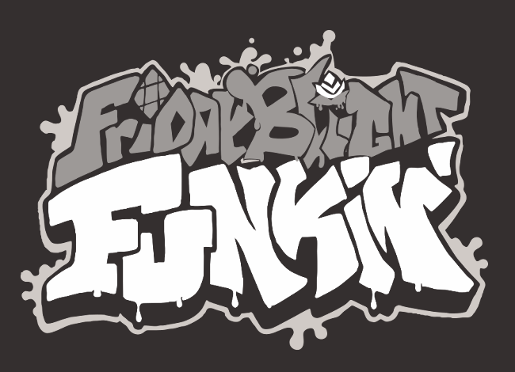

*TODO: add those little CI/CD badges*

# Friday Blight Funkin' : Roseblight mod

## Friday Night Funkin'
**Friday Night Funkin'** is a rhythm game originally made for Ludum Dare 47 "Stuck In a Loop". This **mod** is a crossover with [Roseblight](https://aplovestudio.itch.io/roseblight) ; a story driven game in development about a gardener investigating a crash-landed alien and repairing the bond with his alter ego.

### *[Seriously play it its amazing](https://aplovestudio.itch.io/roseblight)*

Links: **[itch.io page](https://ninja-muffin24.itch.io/funkin) â‹… [Newgrounds](https://www.newgrounds.com/portal/view/770371) â‹… [source code on GitHub](https://github.com/ninjamuffin99/Funkin)**
**[Roseblight Game](https://aplovestudio.itch.io/roseblight) â‹… [source code on GitHub](https://github.com/relma2/roseblight-fnf-mod)**
> Uh oh! Your tryin to kiss ur HOT GOTH girlfriend, but ur MEAN alter ego is trying to REPRESS you!!

## Roseblight Mod
rel: Ok so uh... this is kinda gonna be info thats specific to the mod itself: :P

### Major TODO items
- Desaturate stage asset for the ahokau palette (50% done)
- Mod Qrystal over girlfriend (skin; no actual code) (80% done)
Consult week-structure.md for full TODO list
## Kade Engine
**Kade Engine** is a mod for Friday Night Funkin', including a full engine rework, replays, and more.

Links: ** GameBanana mod page TODO <C-k>Sb other links** 

# Credits
### Friday Night Funkin'
 - [ninjamuffin99](https://twitter.com/ninja_muffin99) - Programming
 - [PhantomArcade3K](https://twitter.com/phantomarcade3k) and [Evilsk8r](https://twitter.com/evilsk8r) - Art
 - [Kawai Sprite](https://twitter.com/kawaisprite) - Music

### Roseblight Mod
 - [Relma](https://github.com/relma2)
 - [Ë](https://github.com/izzonac)
 - [SuperEclipse](https://github.com/SundayMoonday)

Special thanks to [\@AploveStudio](https://aplovestudio.itch.io/)

### Kade Engine
- [KadeDeveloper](https://twitter.com/KadeDeveloper) - Maintainer and lead programmer
