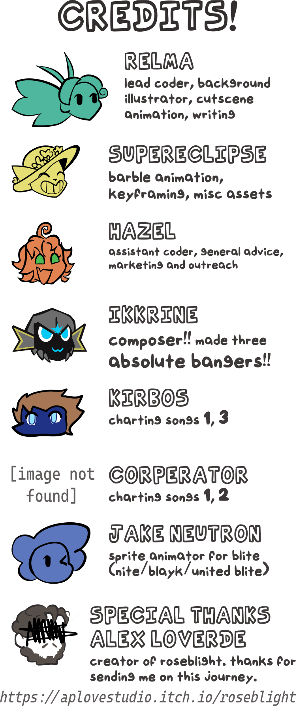

# Friday Blight Funkin' : Roseblight mod

## Friday Night Funkin'
**Friday Night Funkin'** is a rhythm game originally made for Ludum Dare 47 "Stuck In a Loop". This **mod** is a crossover with [Roseblight](https://aplovestudio.itch.io/roseblight); a story driven game in development about a gardener investigating a crash-landed alien and repairing the bond with his alter ego.

### *[Seriously play it its amazing](https://aplovestudio.itch.io/roseblight)*

Links: [**Game Banana WIP Page**](https://gamebanana.com/wips/56972) • [**Newgrounds**](https://www.newgrounds.com/portal/view/770371) • [**Roseblight Game**](https://aplovestudio.itch.io/roseblight) • [**source code on GitHub**](https://github.com/relma2/roseblight-fnf-mod)
> Uh oh! Your tryin to kiss ur HOT GOTH girlfriend, but ur MEAN alter ego is trying to REPRESS you!!

## Roseblight Mod
**WARNING: EXCUSE PLOT**

Oh noes Blite has dethroned girlfriend and put THEIR girl atop the speakers!! (u gotta put her back lol)

TODO: Add Screenshots

## TROUBLESHOOTING COMPILING
```
C:\HaxeToolkit\haxe\std\haxe\macro\ExampleJSGenerator.hx:102 characters 12-17 : Class<haxe.macro.Context> has no field error 
```
This one gave me trouble for absolutely no reason. Navigate to the file C:\HaxeToolkit\haxe\std\haxe\macro\ExampleJSGenerator.hx and comment out **lines 101 and 102**, or the body of the function `checkFieldName`.

```
C:\Path\to\roseblight-fnf-mod>lime build Windows
Error: Could not find haxelib "assertion", does it need to be installed?
```
You need to install the assert library from haxe. Run
```
haxelib install assert 1.0.0
```
### I don't wanna see idiots who didnt read the README on the Issues page or I will roast your dumbass

### Major TODO items
<details>
<summary> Completed Items </summary>

 - [x] Desaturate stage asset for the ahokau palette (done!)

 - [x] Mod Qrystal over girlfriend (skin; no actual code) (done!)

 - [x] Implement Pausa Notes (done!; and with sfx and Q bein scared!!)

 - [x] Compose all 3 songs (mad props to Ikkrine)

 - [x] Fix Barble Animation (Low Priority)
 - [x] Fix stage offsets (Low Priority)

 - [x] Modchart OR Code
  - [x] Nite's pointing and laughing when Combo missed
  - [x] Shop window breaking towards end of song 2
  - [x] Pausa animation from Blite on Pausa notes
  - [x] Screen shaking subtly on Pausa Notes
 

</details>

 - [ ] Chart (66% done)
  - [x] Song 1
  - [ ] Song 2
  - [x] Song 3


 - [x] Add Dialogue (done!)
 - [ ] Implement Cutscene 3 (Placeholder cutscene done, need to)
  - Pan camera over Blite, take one strap off
  - snap animation, camera rapidly zooms over to bf
  - while camera is zomming, have each of the chains in grpchains1 flash in
  - have camera hold on bf_pausad 


 - [x] Blite puting straps on at end of song 1
 - [ ] Jake Neutron creating Sprites for Blayk/United Blite
 - [ ] Relma putting those sprites ingame

### Minor TODO Items
 - [ ] fix the beats at which Nite sings in song 1 so they actually do laugh when its not his turn
 - [ ] fix the modchart cam zoom in song 2 so it stays zoomed in on the broken shop window
 - [x] tint bf miss animations dark
 - [x] make meme face blayks eyes smaller

## Kade Engine
**Kade Engine** is a mod for Friday Night Funkin', including a full engine rework, replays, and more.

# Credits

### Roseblight Mod


### Kade Engine
- [KadeDeveloper](https://twitter.com/KadeDeveloper) - Maintainer and lead programmer
